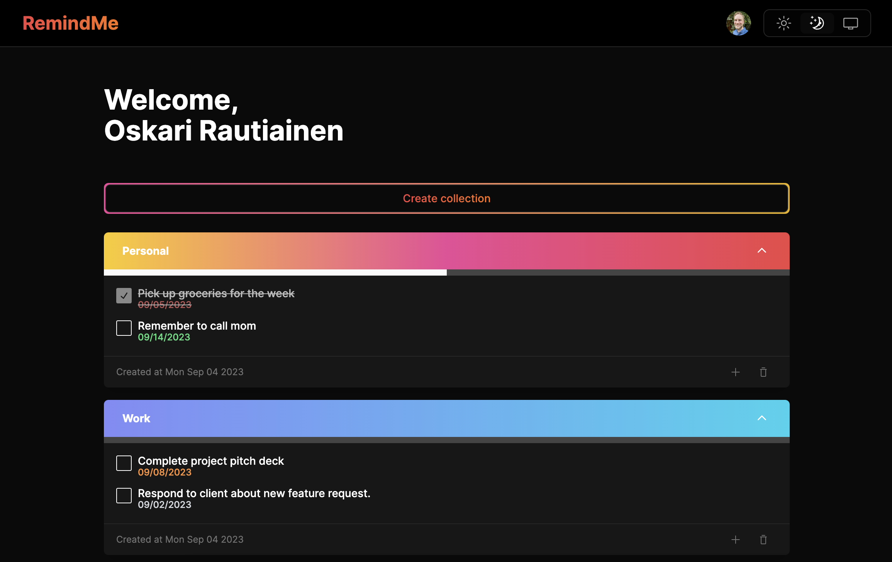

# Remind Me

A simple reminder app built using Next.js, TypeScript, Tailwind and Prisma.

Check out the [live app](https://remind-me-oskari.vercel.app/).



## Getting Started

First, run the development server:

```bash
yarn dev
```

Open [http://localhost:3000](http://localhost:3000) with your browser to see the result.

## Running Prisma Studio

You can run the Prisma Studio to see a live view of the database using:

```bash
yarn studio
```

And opening [http://localhost:5555](http://localhost:5555).

## References

This project was built based on the Remind Me tutorial from [https://youtu.be/jAMVODrNd9I?si=FWprZVDgCynRXSkK](https://youtu.be/jAMVODrNd9I?si=FWprZVDgCynRXSkK).
